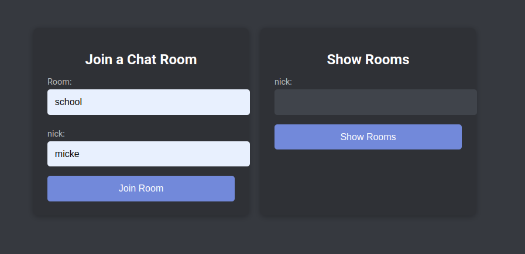
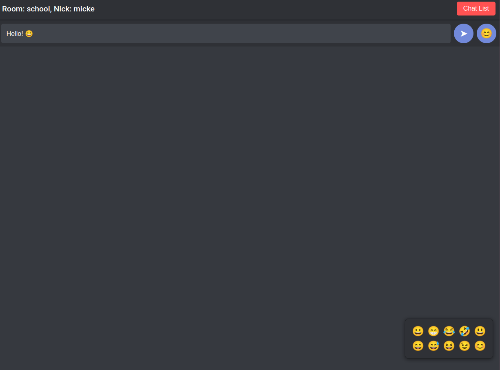
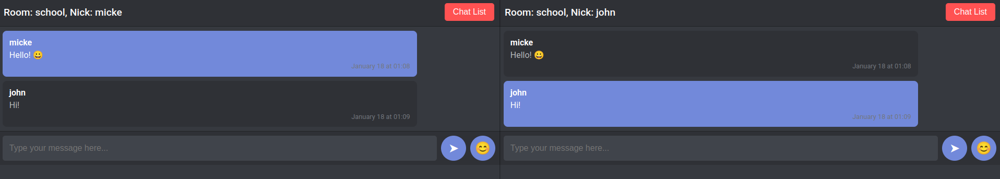
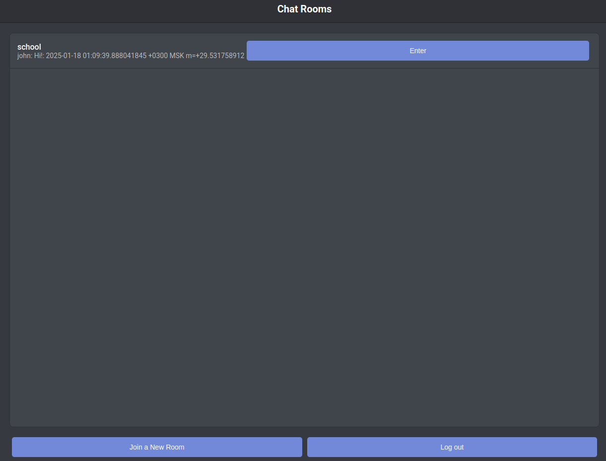

# Chatroom Application
## Overview
This is a decentralized (децентрализованное) chatroom application built with Golang and leveraging the `chat` application which uses `go-libp2p-pubsub` library for peer-to-peer communication. The `frontend` package provides an HTTP interface for managing chatrooms, handling user sessions, and serving the front-end views for interacting with the chat system.

## Example Workflow
1. Start the first instance of the application:
   ```bash
   ./chatroom
   ```
2. Login:




3. Send message:


4. Start another instance of the application on the same network and send message:
   ```bash
   ./chatroom
   ```


5. If we click on `Chat List` we go on page: 



### Test Running

1. You need to setup `running/config/config.yml` and `running_copy/config/config.yml` by equal values. Fill correct host, port and peerid for launched chat node (see [backend README](./chat/README.md) to know more)

2. Go to folder `running` and `running_copy` and you will have 2 users in your net:

   ```bash
   cd running
   ./chatroom
   ```

   ```bash
   cd running_copy
   ./chatroom
   ```

### Features
- Decentralized chatroom communication using `go-libp2p-pubsub`.

- Front-end built with HTML, CSS, and JavaScript.

- Live updates for chatroom lists and messages.

### Submoduls
- See more about application frontent in [frontend README](./frontend/README.md)
- See more about application backend (work with go-libp2p-pubsub) in [backend README](./chat/README.md)

## Future
- Add authentification mechanism. Where you can create private rooms.
- Transform to social network. Send not only messages, but posts and other.
- Add monetization and own currency.